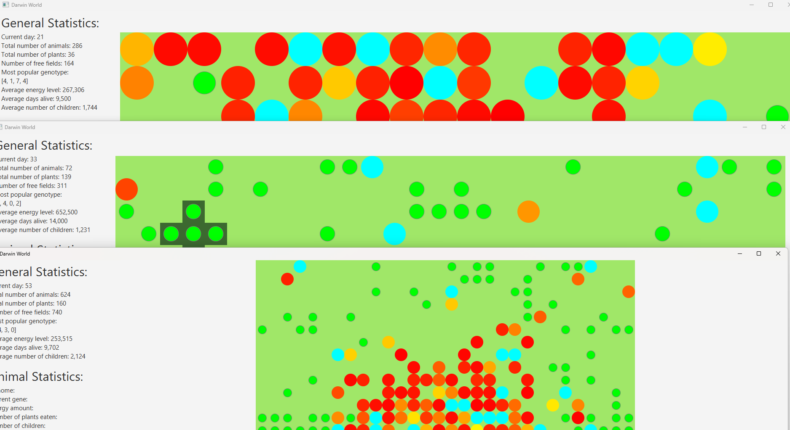
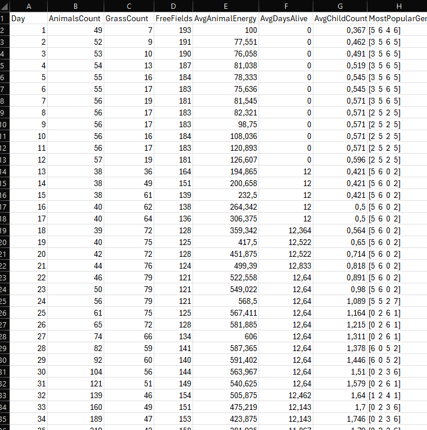
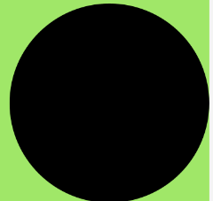
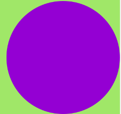
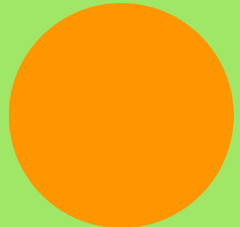
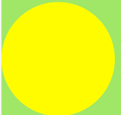
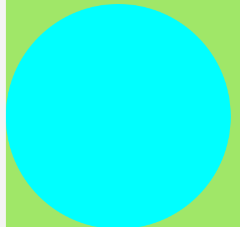
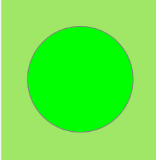

# Darwin World

## Authors
- **[Filip Mokrzycki](https://github.com/Filipmok-agh)** 
- **[Jakub Fabia](https://github.com/jakub-fabia)**

## Description
The goal of the project was to create an application to simulate and visualize the behavior of animals based on the rules described [here](https://github.com/Soamid/obiektowe-lab/tree/a56b132b6f10a73c6df9e9040804f649a894cd3e/proj). 

## Technologies and Tools  
- **Programming Language**: Java 21  
- **Build Tool**: Gradle  
- **Libraries**: JavaFX  
- **Testing**: JUnit

### Features:

#### 1. **Starting Screen**:

### 2. **Menu Screen**:
   - The user can specify simulation options.
   - Options can be imported or saved.
   - The user can choose whether statistics will be saved.
   - Multiple simulations can be started (options are validated).

### 3. **Simulation Screen**:
   - The simulation displays animal movement.
   - The simulation shows statistics for all animals and for the observed one.
   - The simulation can be stopped.
   - The user can change jungle visibility and highlight animals with the most popular genome.
   - The user can observe an animal by simply clicking on it on the map.
   - The observed animal is highlighted, and its stats are updated in real time.

#### **Jungle Positions**  
  

#### **Observed Animal and Animals with the Most Popular Genome**  
  

### 4. **Multithreading**
   - The user can start multiple simulations at the same time thanks to the multithreading system.  

### 5. **Statistics Saving**

## **Explanation of Simulation Symbols**

### Animal

 - Observed  
    
 - Most Popular Genome  
    
 - Low Energy  
    
 - Medium Energy  
    
 - High Energy  
    
 - Very High Energy  
    

### Grass  

### Fertile Land (Jungle)  

### Standard Land (Steppe)  

